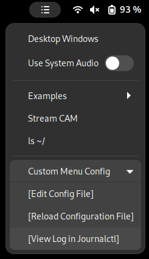
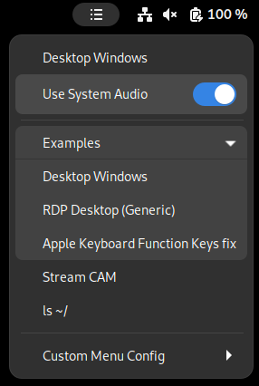

# Gnome Custom Menu Panel
Custom menu on Gnome Top Bar with your favorite program shortcuts.





### Usage:
- An `.entries.json` file will automatically be created within your $HOME directory, if it does not already exist. (**_$HOME/.entries.json_**).

- Edit the file by clicking [Edit Config File] within the Custom Menu Config submenu and add your favorite commands, referencing the .entries.json file in this examples directory for ideas. It is a `.json` file so respect syntax and commands accordingly. For example, use commas after each item, but not on the last item.

- Reload the configuration file for changes to take effect by choosing *[Reload Configuration File]* from the *Custom Menu Config* submenu. Alternatively, disable/enable the plugin within the Extensions app or restart the entire Gnome environment using (Alt+F2, 'r', Enter).

- If you make a mistake in the .entries file and a JSON parse error occurs, a submenu entitled *'Config File Parse Error . . . '* is displayed in the custom menu and automatically expands to show *[Edit Config File]*, *[Reload Config File]* and *[View Log in Journalctl]*.

- The optional constants, 'editorExecutable', defaulted to 'gedit' and 'terminalExecutable', defaulted to 'gnome-terminal' are currently only used for the permanent *Custom Menu Config* submenu items , where *[Edit Config File]* uses 'editorExecutable' and *[View Log in Journalctl]* uses 'terminalExecutable'. These have been tested with Geany and Tilix, respectively.

The widgets manual below describe available entry types, and the .entries.json file in the `examples` directory showcases usage thereof.


---

## Widgets Manual
Here are common widgets and entities you can use with this plugin:
### **- Launcher**
Create a new entry and put it in the menu
```json
    {
      "type": "launcher",
      "title": "Item Name on Menu",
      "command": "/your/command/to/execute --with-parameters"
    },
```

### **- Separator**
Place a menu separator _(\<hr>)_
```json
    {
      "type": "separator"
    },
```

### **- SubMenu**
Create a submenu inside current menu, items inside the submenu are placed inside `entries`
and they can be of any type (launcher, separator, submenu, ...)
```json
    {
        "type": "submenu",
        "title": "Menu Name",
        "entries": [
            //... Place your entries here ...//
        ]
    },
```

### **- Toggler**
Create a toggle item on menu, it has a detector and ON|OFF commands.
Command detector can be _activated|deactivated_ by a **0** _(success)_ return error level
and later detected with a plain JavaScript eval. See graphical result on above screenshots
```json
    {
      "type": "toggler",
      "title":       "Widget Title",
      "command_on":  "/command/when/turned/on",
      "command_off": "/command/when/turned/off",
      "detector":    "/command/detector > /dev/null && echo yes"
    },
```


## History and License
License: GPL v3

This expands upon previous GPL works listed below in the predecessors section by adding:
- Expansion of Gnome compatibility to v43
- The ability to reload the configuration file, rebuild the menu and revalidate the configuration file JSON syntax without having to restart Gnome using the "Alt-F2, r" method or by logging in/out of the Gnome session.
- Added optional constants to the default configuration file (~/.entries)
	- 'editorExecutable', defaulted to 'gedit' (for Gnome < 42), 'gnome-text-editor' (for Gnome > 43) and
	- 'terminalExecutable', defaulted to 'gnome-terminal'.
	- These values are currently only used for the permanent 'Custom Menu Config' submenu items, where [Edit Config File] uses 'editorExecutable' and [View Log in Journalctl] uses 'terminalExecutable'.
	- The user remains able to specify their preferred text editor in the confiugration file to deviate from the default.
		- Tested custom values for 'editorExecutable' with Geany and 'terminalExecutable' with Tilix.
	- If a configuration file parsing error is detected, the appropriate text-editor is determined based on the Gnome Version.
	- As gnome-text-editor has replaced gedit in Gnome 43, the default text editor is now defined as a function of Gnome version being >= 43 or less than 43. The default text editor is used during generation of a default configuration file, as well as used as an editor to spawn when the configuration file parsing error is detected. 
- Added automatic expansion of the 'Custom Menu Config' submenu if ~/.entires JSON parsing fails.
---

GPL Predecessors (Newer to Older)

- https://github.com/andreabenini/gnome-plugin.custom-menu-panel (GPL v3)
- https://github.com/Shihira/gnome-extension-quicktoggler (GPL v2)
	- Deprecated - Author switched to developing for KDE.
